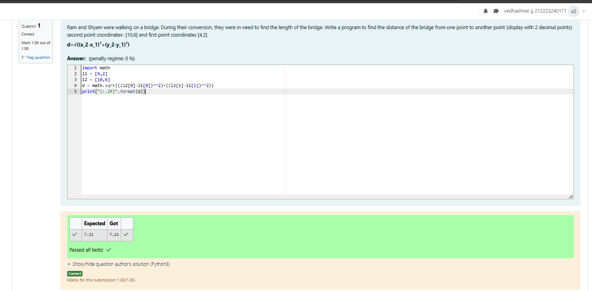

# DISTANCE-BETWEEN-TWO-POINTS

## AIM:
To write a python program to find the distance two 2 points
## ALGORITHM:
### Step 1: 
Using impot math function,do the calculation
### Step 2: 
Take the two coordinates as |1 and |2
### Step 3: 
Substitute the values in the distance formula  
### Step 4: 
Using the print function display the distance between the two poitns
### Step 5: 
End the program
### PROGRAM:
Developed by:Vedhashree.G
Register No:212223240171
---
import math 

l1 = [4,2]

l2 = [10,6]

d = math.sqrt(((l2[0]-l1[0])**2)+((l2[1]-l1[1])**2))

print("{:.2f}".format(d))
---

### OUTPUT:

### RESULT:
Thus the distance of the two points is successfully executed and displayed.
